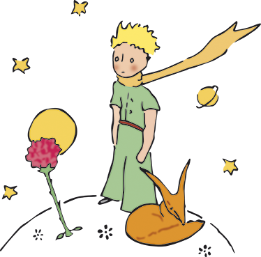

# The Little Prince RAG

A Retrieval-Augmented Generation (RAG) chatbot that answers questions about Antoine de Saint-Exupéry's *The Little Prince*, using Gemini and ChromaDB.



## How it works

1. **Ingest** — every PDF/text file in `data/` is split into overlapping chunks, embedded with `all-MiniLM-L6-v2`, and stored in a local ChromaDB vector database. The novella itself (`TheLittlePrince.pdf`) is tagged `kind=book`; everything else (background, themes, character list, plot analysis) is tagged `kind=reference`.
2. **Query** — each question is spell-corrected, embedded the same way, and the top-8 nearest passages are retrieved across all sources.
3. **Generate** — the passages are handed to `gemini-2.5-flash` (via Gemini's API) as grounding context. The model may quote `book` passages verbatim, but must paraphrase `reference` passages in its own words rather than reciting them — they're there to inform the analysis, not to be read back to the user.

## Requirements

- Python 3.11+
- A free [Gemini API key](https://aistudio.google.com/apikey)
- Your own copy of *The Little Prince* as a PDF or `.txt` file, named `TheLittlePrince.pdf` (or update `BOOK_FILENAME` in `ingest.py`), plus any optional reference material (background, themes, character notes, plot analysis) — all placed in `data/`

> **Note:** `data/` and `chroma_db/` are gitignored and not part of this repo. The book text and any reference material (e.g. study-guide PDFs) are third-party copyrighted content — supply your own copies locally rather than committing them.

## Setup

```bash
python3 -m venv .venv
source .venv/bin/activate   # on Windows: .venv\Scripts\activate
pip install -r requirements.txt
export GEMINI_API_KEY=your-key-here   # or put it in .streamlit/secrets.toml
```

> If you have multiple Pythons installed (Homebrew, conda, system, etc.), use the venv above rather than a bare `pip install` — otherwise `pip` and the interpreter that actually runs the app can silently point to different environments.

## Usage

### 1. Ingest the book and reference material

```bash
python ingest.py
# or, to ingest a different directory
python ingest.py --data-dir mydata
```

This ingests every `.pdf`/`.txt` file found directly in `data/` (non-recursive) and creates a `chroma_db/` directory containing the vector index. Re-run it any time you add or update a file in `data/` — it rebuilds the index from scratch.

### 2a. Launch the Streamlit UI

```bash
streamlit run app.py
```

Opens a chat interface in your browser. Retrieved source passages are shown in the sidebar after each answer.

### 2b. Use the CLI instead

```bash
# Interactive mode
python rag.py

# Single question
python rag.py "What does the fox teach the little prince?"
```

## Project structure

```
.
├── app.py          # Streamlit chat UI
├── rag.py          # Retrieval + prompt logic; CLI entry point
├── llm.py          # Chat-completion backend (Gemini; swap here for a different provider)
├── ingest.py       # Chunking, embedding, and ChromaDB indexing
├── requirements.txt
├── data/           # Source material: the novella + reference PDFs (gitignored)
└── chroma_db/      # Auto-generated vector store (gitignored, rebuild with ingest.py)
```

## Configuration

Key constants live at the top of each file:

| File | Constant | Default | Description |
|------|----------|---------|-------------|
| `llm.py` | `MODEL` | `gemini-2.5-flash` | Gemini model used for generation |
| `rag.py` | `TOP_K` | `8` | Number of passages retrieved per query |
| `rag.py` | `EMBED_MODEL` | `all-MiniLM-L6-v2` | Sentence-transformer embedding model |
| `ingest.py` | `DATA_DIR_DEFAULT` | `data` | Directory scanned for `.pdf`/`.txt` files to ingest |
| `ingest.py` | `BOOK_FILENAME` | `TheLittlePrince.pdf` | The one file tagged `kind=book` (quotable verbatim); every other file is tagged `kind=reference` (paraphrase-only) |
| `ingest.py` | `CHUNK_SIZE` | `400` | Target characters per chunk |
| `ingest.py` | `CHUNK_OVERLAP` | `80` | Character overlap between adjacent chunks |

## Deploying publicly

`llm.py` calls Gemini's hosted API, so it works on Streamlit Community Cloud (or anywhere else) as long as `GEMINI_API_KEY` is set — add it under Settings → Secrets on Streamlit Cloud (`GEMINI_API_KEY = "..."`), which Streamlit also exposes as an environment variable.

Since `chroma_db/` and `data/` aren't committed (copyrighted content), `app.py` resolves the index in this order:

1. **Local prebuilt index** — if `chroma_db/` exists (e.g. you ran `ingest.py`), it's used directly, same as running locally.
2. **Private remote fetch** — if `DATA_GITHUB_TOKEN` and `DATA_GITHUB_REPO` are set (see below), `app.py` downloads the book/reference files from a private repo and builds the index once per container, via `fetch_and_build_remote_index()`. Every visitor gets the chat straight away; nothing copyrighted ever touches this public repo.
3. **Per-visitor upload** — if neither applies, each visitor is shown a file uploader and the index is built in-memory for just their session, via `ingest.build_session_collection()`. Nothing uploaded is written to disk.

To set up option 2 for your own deployment:

1. Create a **separate, private** GitHub repo (e.g. `little-prince-rag-data`) containing just a `data/` folder with your book/reference files.
2. Generate a [fine-grained GitHub token](https://github.com/settings/personal-access-tokens) scoped only to that repo, with read-only "Contents" permission.
3. On Streamlit Cloud, add two secrets: `DATA_GITHUB_TOKEN = "..."` and `DATA_GITHUB_REPO = "yourname/little-prince-rag-data"`.
